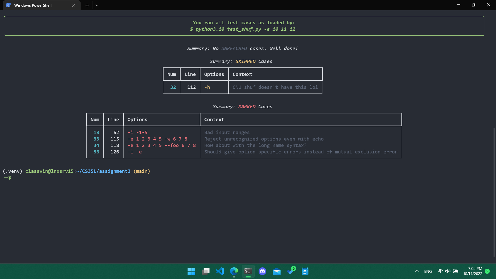

# shuf.py Interactive Tester

## Installation

**Prerequisite:** for the last time, make sure `/usr/local/cs/bin` is prepended to your `PATH`!

```console
$ export PATH=/usr/local/cs/bin:$PATH
$ python3.10 --version  # if this works, you're good
Python 3.10.7
```

On the SEASnet server, **navigate to the directory containing your shuf.py**.

You can then download my distribution and extract it. I also recommend you set up a virtual environment before installing dependencies. If you trust me, paste this entire code block and it should work its magic:

```shell
curl https://raw.githubusercontent.com/vinlin24/test-shuf/main/test_shuf.tgz --output test_shuf.tgz
tar -xvf test_shuf.tgz
python3.10 -m venv .venv
source .venv/bin/activate
pip3.10 install rich
python3.10 test_shuf.py --help
```

My script uses the [rich](https://github.com/Textualize/rich) library for fancy outputting.

If `curl` fails for whatever reason, [just download the file from my GitHub](https://github.com/vinlin24/test-shuf/blob/main/test_shuf.tgz) and copy it onto the remote server, then resume the steps.

## Usage

For the best experience, full-screen your terminal :D

To test with [my provided test cases](src/test_cases), run:

```
python3.10 test_shuf.py
```

Each test case is fed to you one screenful at a time. Compare the outputs. Hit `RET` to ACCEPT them, `m` to MARK them, etc. MARKED test cases will be presented to you on a summary screen at the end of the program for your review.

To modify or add more test cases, edit the [test_cases](src/test_cases) file. You can reference the instructions and examples there to write your own. You can also tweak the [test_input](src/test_input) file.

```shell
emacs test_cases
emacs test_input
```

You can preview how the test cases are loaded and parsed with:

```shell
python3.10 test_shuf.py --list
```

The script supports some command line arguments to give you control (albeit a bit limited) over what test cases to use:

```shell
python3.10 test_shuf.py --exclude 10 11 12
python3.10 test_shuf.py --include $(seq 32 36)
python3.10 test_shuf.py --custom-only
```

As usual, for more information about each option, run:

```console
$ python3.10 test_shuf.py --help
usage: test_shuf.py [-h] [-l] [-c] [-i [CASE_NUMS ...] | -e [CASE_NUMS ...]]

Interactive tester for shuf.py.

options:
  -h, --help            show this help message and exit
  -l, --list            list the parsed test cases from test_cases and exit
  -c, --custom-only     only list or run your custom test cases
  -i [CASE_NUMS ...], --include [CASE_NUMS ...]
                        include only these test cases (as numbered in --list)
  -e [CASE_NUMS ...], --exclude [CASE_NUMS ...]
                        exclude these test cases (as numbered in --list)
```

**Quick Troubleshooting Note**

If you get a `ModuleNotFoundError` for `rich`, that probably means you have since left the virtual environment, so reactivate it first with:

```shell
source .venv/bin/activate
```

or just install it globally. It’s a beautiful library :)

```shell
pip3.10 install rich
```

## Disclaimer

- Because output is *meant* to be random and help messages do not have to exactly match, it was very impractical to write a unit tester or other conventional testing mechanism. That's why this tester is *interactive*, and requires you to compare the outputs and ACCEPT or MARK the test cases.
- I do not claim my provided test cases to be an exhaustive list.
- I struggled implementing the I/O with cases involving stdin, so be sure to double-check such test cases on your own (e.g. manually entering entries capped with `C-d`, or piping output into your shuf.py with `|`).

## Preview

An example comparison:


An example of the program automatically marking an egregious difference:


An example summary screen:

